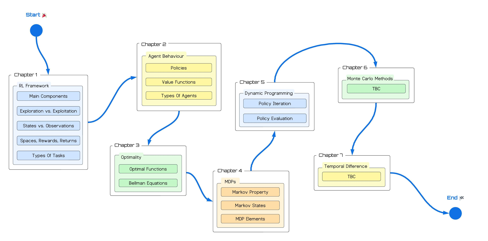

# Reinforcement Learning Fundamentals Guide

This repository houses the exercises, code snippets, and roadmap for my Reinforcement Learning (RL) fundamentals guide. You can view the details on Medium [here](https://medium.com/@achronus/im-making-a-guide-on-the-fundamentals-of-rl-here-s-what-you-need-to-know-2efadae9eec8).

The guide is still in development and will be released as an e-book upon completion. Chapters available can already be viewed on Medium and will remain there indefinitely. You can use the same link above to find them.

The fundamentals outlined in this guide intend to fast-track people into RL by giving them the essential information they need to progress from zero knowledge to Deep RL. We highlight this content in the roadmap below and discuss future content after the guide's completion.

## Roadmap

As mentioned, the roadmap highlights the aspects of the guide, giving readers a lay of the land before diving head-first into it. You can view it below.

You may notice that some of the chapter content is TBC. This is deliberate. At the time of writing, I am still creating the guide chapter by chapter, and sometimes, it is hard to identify the best content until I write it. Therefore, the roadmap will be updated as time goes on.

It is worth noting that the theme of the chapters will remain. For example, Monte Carlo and Temporal Difference methods are planned for the guide, but how their chapters are structured is still being considered.

### Future Content

RL is a large field, especially when discussing Deep Learning algorithms! Once this guide is complete, I plan to continue my RL journey and discuss this area in more detail. Some things to look forward to include:

- Deep Reinforcement Learning algorithms (PPO, DQN, RQDN, etc.)
- Intrinsic Motivation methods
- ... And more!

## Structure and Dependencies

We structure this repository into its respective chapters. Code snippets follow naming conventions related to what they highlight, and exercise solutions are in a `solutions` folder (per chapter).

All code snippets and exercises have been tested using `Python 3.12.0` and the Python packages listed in the `requirements.txt` file. If you run the solutions yourself and encounter bugs, please create an [issue](https://github.com/Achronus/rl-fundamentals-guide/issues) here on GitHub.
